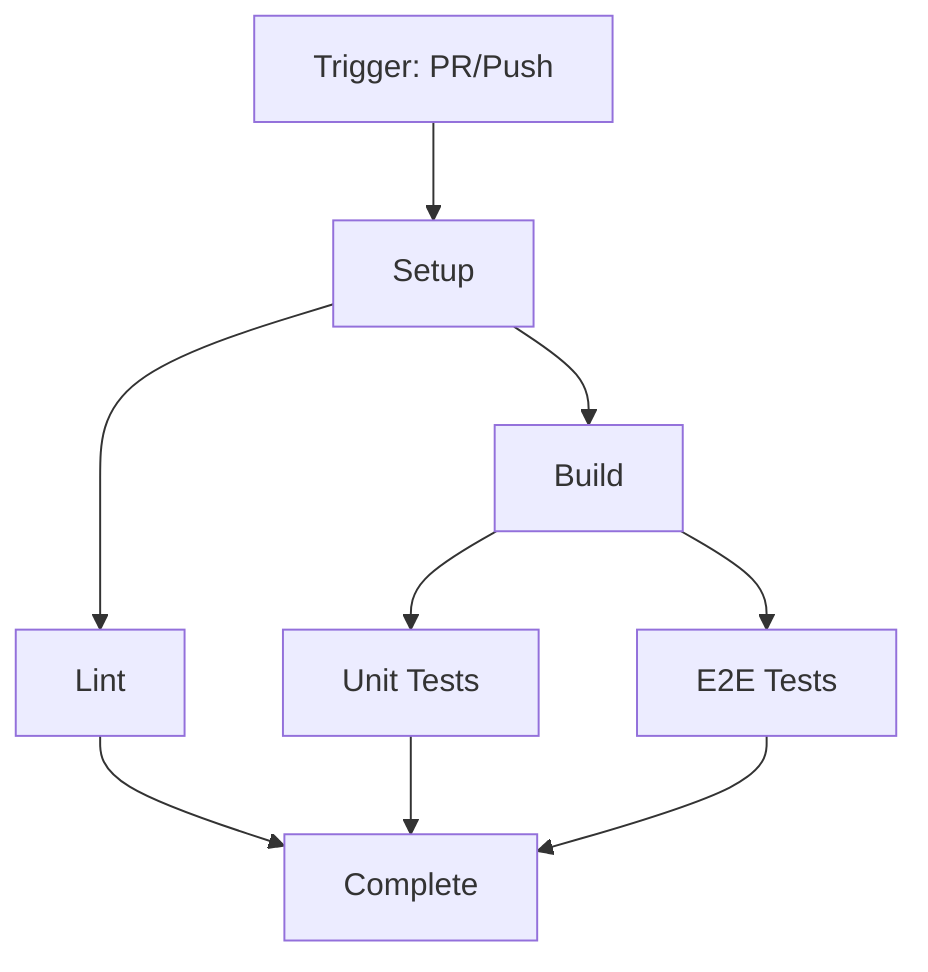
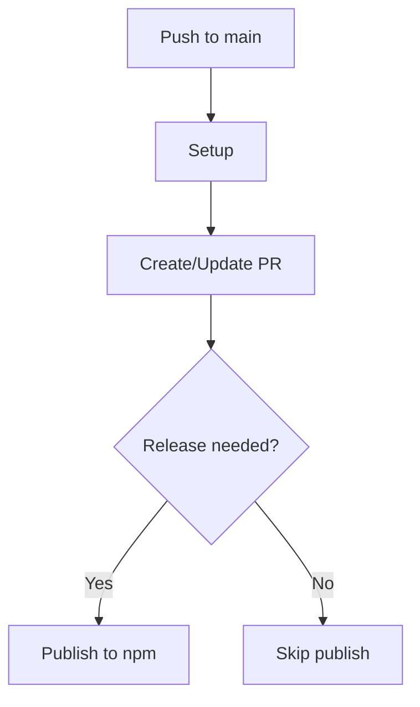
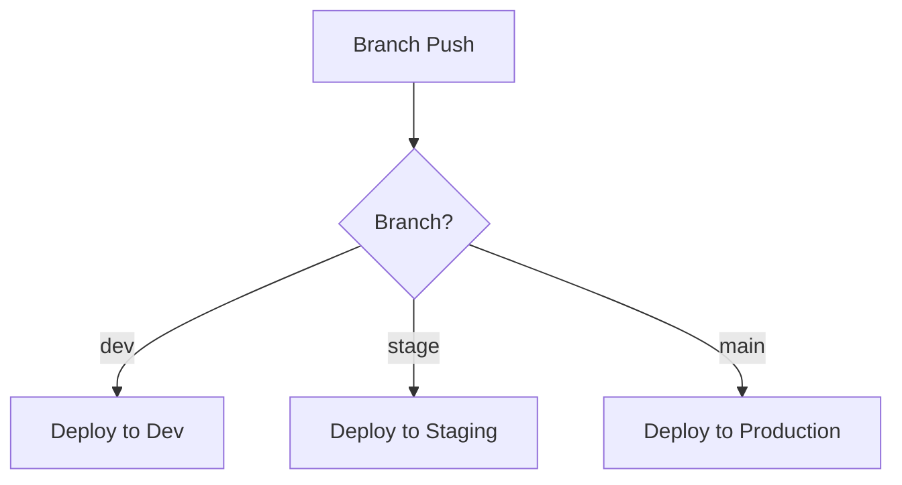

# CI/CD Pipeline Guide

This guide explains the Continuous Integration and Continuous Deployment (CI/CD) pipeline implemented in this monorepo using GitHub Actions.

## Overview

Our CI/CD pipeline is designed to ensure code quality, maintain consistent builds, and automate deployments across the monorepo. It leverages GitHub Actions for workflow automation, with efficient caching strategies for pnpm and Turborepo.

## GitHub Actions Workflows

### 1. CI Workflow

The CI workflow runs on pull requests and pushes to main, executing jobs in parallel for maximum efficiency:



Key features:

- Parallel execution of lint, build, and test jobs
- Efficient caching with pnpm and Turborepo
- Artifact sharing between jobs
- Node.js LTS version (22.14.0)

Example workflow structure:

```yaml
jobs:
  setup:
    # Initial workspace setup
    steps:
      - Setup Node.js and pnpm
      - Install dependencies
      - Cache dependencies
      - Upload workspace

  lint:
    needs: setup
    steps:
      - Download workspace
      - Run linting

  build:
    needs: setup
    steps:
      - Build packages
      - Upload artifacts

  test-unit:
    needs: build
    steps:
      - Run unit tests

  test-e2e:
    needs: build
    steps:
      - Run E2E tests
```

### 2. Release Workflow

The release workflow automates package versioning and publishing using Changesets:



Features:

- Automated version management
- Changelog generation
- npm package publishing
- GitHub release creation

### 3. Deployment Workflow

Template for environment-specific deployments:



Features:

- Environment-based deployments
- Branch-specific configurations
- Deployment safety checks
- Rollback capabilities

## Caching Strategy

### pnpm Cache

```yaml
- name: Get pnpm store directory
  run: echo "STORE_PATH=$(pnpm store path --silent)" >> $GITHUB_ENV

- name: Setup pnpm cache
  uses: actions/cache@v4
  with:
    path: ${{ env.STORE_PATH }}
    key: ${{ runner.os }}-pnpm-store-${{ hashFiles('**/pnpm-lock.yaml') }}
    restore-keys: |
      ${{ runner.os }}-pnpm-store-
```

Benefits:

- Faster dependency installation
- Reduced network traffic
- Consistent package versions

### Turborepo Cache

```yaml
- name: Setup Turborepo cache
  uses: actions/cache@v4
  with:
    path: .turbo
    key: ${{ runner.os }}-turbo-${{ github.sha }}
    restore-keys: |
      ${{ runner.os }}-turbo-
```

Benefits:

- Cached build outputs
- Faster subsequent builds
- Task-level caching

### Artifact Sharing

```yaml
- name: Upload build artifacts
  uses: actions/upload-artifact@v4
  with:
    name: build-artifacts
    path: |
      **/dist
      **/.next
      **/build
```

Use cases:

- Share built files between jobs
- Preserve test results
- Store deployment artifacts

## Environment Configuration

### Required Secrets

- `TURBO_TOKEN`: For Turborepo remote caching
- `TURBO_TEAM`: Team identifier for Turborepo
- `NPM_TOKEN`: For package publishing
- `GITHUB_TOKEN`: Automatically provided

### Environment Variables

```yaml
env:
  NODE_ENV: production
  TURBO_TOKEN: ${{ secrets.TURBO_TOKEN }}
  TURBO_TEAM: ${{ vars.TURBO_TEAM }}
```

### Branch Protection

Configure in GitHub:

1. Require status checks
2. Require reviews
3. Enforce linear history
4. Protect against force push

## Best Practices

### 1. Workflow Optimization

- Use parallel jobs where possible
- Implement efficient caching
- Share artifacts between jobs
- Minimize redundant steps

### 2. Security

- Never expose secrets in logs
- Use environment protection rules
- Implement proper secret rotation
- Scan for security vulnerabilities

### 3. Maintenance

- Keep actions up to date
- Monitor workflow performance
- Clean up artifacts regularly
- Document workflow changes

### 4. Troubleshooting

Common issues and solutions:

1. **Cache Invalidation**

   ```bash
   # Clear Turborepo cache
   pnpm turbo clean

   # Clear pnpm store
   pnpm store prune
   ```

2. **Failed Builds**
   - Check dependency installation
   - Verify cache restoration
   - Review build logs
   - Check resource limits

3. **Deployment Issues**
   - Verify environment variables
   - Check deployment prerequisites
   - Review service health
   - Monitor rollout status

## Integration with Development Workflow

### Local Development

Before pushing:

```bash
# Run checks locally
pnpm check

# Fix issues
pnpm check:fix
```

### Pre-commit vs CI

Local checks:

- Fast feedback loop
- Basic validations
- Format and lint

CI checks:

- Complete test suite
- Build verification
- Cross-platform testing

### Release Process

1. Create changeset:

   ```bash
   pnpm changeset
   ```

2. Push changes:

   ```bash
   git push origin feature/my-feature
   ```

3. CI/CD pipeline:
   - Runs checks
   - Creates/updates release PR
   - Publishes when merged

## Further Reading

- [GitHub Actions Documentation](https://docs.github.com/en/actions)
- [Turborepo Caching](https://turbo.build/repo/docs/core-concepts/caching)
- [pnpm CI/CD Guide](https://pnpm.io/continuous-integration)
- [Changesets Documentation](https://github.com/changesets/changesets/tree/main/docs)
