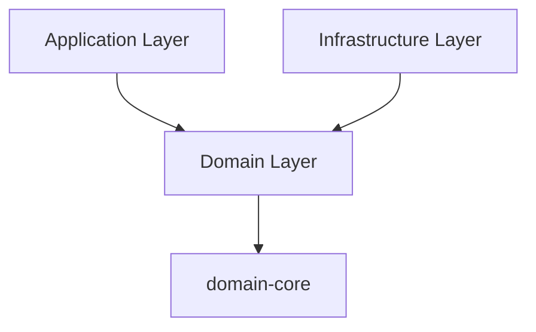

# Domain Layer Rules

This document serves as a quick reference for maintaining clean domain architecture. For full details, see [ADR-009: Domain Isolation Principle](../docs/adrs/ADR-009-domain-isolation-principle.md).

## ⚠️ Critical Rules

1. **No Infrastructure Dependencies**
   - Domain packages should have as close to zero dependencies as possible. This keeps the business logic safe from external changes.
   - Domains MUST NOT depend on infrastructure packages
   - No direct imports of packages like bcrypt, uuid, etc.
   - Infrastructure implements domain interfaces, never the reverse

2. **Core Domain Patterns**
   - Common patterns (Entity, ValueObject, DomainService, etc.) belong in domain-core
   - Individual domains should not define their own versions of these patterns
   - Example: Don't create a DomainService interface in auth domain - use the one from domain-core

3. **Interface Ownership**
   - Domains own and define interfaces that infrastructure implements
   - Infrastructure packages depend on domain interfaces
   - Dependencies flow toward the domain, never outward

4. **Pure Business Logic**
   - Domain code should contain only business rules and logic
   - No framework dependencies
   - No infrastructure concerns

## 🚫 Common Violations to Watch For

1. **Direct Infrastructure Usage**
   ```typescript
   // ❌ WRONG: Direct infrastructure dependency
   import bcrypt from 'bcryptjs';
   
   // ✅ CORRECT: Use domain interface
   import type { HashService } from './HashService';
   ```

2. **Misplaced Core Patterns**
   ```typescript
   // ❌ WRONG: Core pattern in specific domain
   // auth/src/services/DomainService.ts
   export interface DomainService<T> { ... }
   
   // ✅ CORRECT: Use from domain-core
   import { DomainService } from '@repo-domains/domain-core';
   ```

3. **Framework Dependencies**
   ```typescript
   // ❌ WRONG: Framework dependency
   import { Controller } from '@nestjs/common';
   
   // ✅ CORRECT: Pure domain code
   export class UserService { ... }
   ```

## 📝 Package.json Guidelines

Your domain package.json should typically only have these dependencies:
```json
{
  "dependencies": {
    "@repo-domains/domain-core": "workspace:*"
  }
}
```

## 🔍 Review Checklist

Before committing domain changes, verify:

- [ ] No infrastructure package dependencies
- [ ] No framework dependencies
- [ ] Core patterns imported from domain-core
- [ ] Interfaces defined for external functionality
- [ ] Pure business logic only
- [ ] Framework-independent tests

## 🏗️ Architecture Reminder



- Domain layer defines interfaces
- Infrastructure implements interfaces
- Application wires everything together
- Dependencies point toward domain-core
